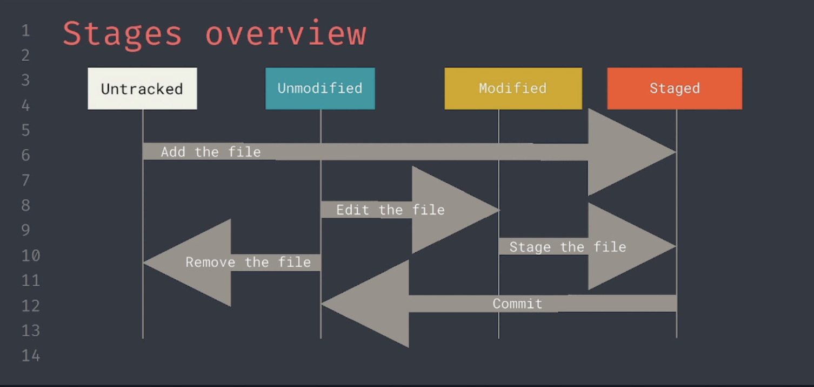

# **_Git Introduction_**

**_What is git? and why should you use git?_**

_Git is a DevOps tool used for source code management. It is a free and open-source version control system used to handle small to very large projects efficiently. Git is used to tracking changes in the source code, enabling multiple developers to work together on non-linear development._

# **_Download Git_**

_Download url_ : [https://git-scm.com/download](https://git-scm.com/download)

Windows : recommanded (not required) to install git bash

_- Check installation_ : excecute in terminal

```
$ git --version
```

# **_Configure Git_**

_Global vs local Config_

```
$ git config --global user.name "You Name"
$ git config --global user.email "you@example.com"
```

# **_Create a Repository_**

_Create repository for your project_

```
$ git init
```

Initialized empty git repository on your current location.

```
$ git status
```

on branch master

no commits yet

nothing to commit (create/copy files and use "git add" to track)

```
$ ls -a
```

```
./ ../ .git/
```

# **_Clone a Repository_**

_Clone repository with HTTPS and SSH_

**_HTTPS:_**

```
$ git clone https://github.com/../<project>.git
```

**_SSH:_**

```
$ git clone git@github.com/../<project>.git
```

# **_Making changes_**

_Making Change and syncing versions_

Persisting changes is done by commiting them. New file are "untracked" and need to be add menually. Change to existing files have to by staged.

```
$ git add <file>
```

After adding it, it is ready to committed.

```
$ git commit -m "Your Message"
```

# **_Undo changes_**

If you by accident stage a file. You can alway unstage it. Even changes you made can easily be discard.

_Unstage a file_

```
$ git restore --staged <file>
```

Afterward the file show up.

_Discard changes:_

```
$ git restore <file>
```

Becareful to dicard changes since they can not be recovered.

**_Why keep unstaged file_**

- Local Configuration
- Changes that are not finished
- Grouping changes together in seperate commits



# **_Sharing changes_**

_Commited changes are not yet avaiable for orthers. you have to push them._

```bash
$ git push
```

_To update your version with the one remotely_

```bash
$ git pull
```

# **_Git Branch_**

**_Working on multiple Tracks_**

**_Why use branches_**

- _Branches allow multiple people to work in parallel without problem_
- _Protected certain branches_
- _Execute check before accepting changes_

## **_Command:_**

See an overview of all branches and the current one:

```
$ git branch
```

**_Create a branch_**

```
$ git branch <branch-name> # creates a new branch from the current one

$ git branch <branch-name> <source-branch> # creates a branch from source
```

**_Switch to a branch_**

```
$ git checkout <branch-name>
```

### **_Noted &#x3f;_**

_You can also create a new branch and checkout it in one go by doing:_

```
$ git checkout -b <branch-name>
```

# **_Merging Branches_**

**_Why use merge branches_**

- _Done automatically by hosted repositories (Github, Gitlab, Stash, ...)_
- _In case of conflict, you will steal need to do it yourself_

```
$ git merge <branch-name>
```

- _Merging the branch in to current one._

### **_Noted &#x3f;_**

_Merging does not fix conflicts, they force you to deal with them._

# **_Resolve Conflicts_**

Can be done in any editor.

Most IDEs have nicer 3-way merge views.

### **_How a conflict look like in the file_**

```
<<<<<<< HEAD
World
===========
Hello
>>>>>>> branchA
```

```
$ git merge --abort
```

# **_Remove Branch_**

```
$ git branch -D <branch-name>
```

## **_History Information_**

```
$ git log
```

## **_Go back a Commit_**

```
$ git reset --mixed HEAD~1
```
